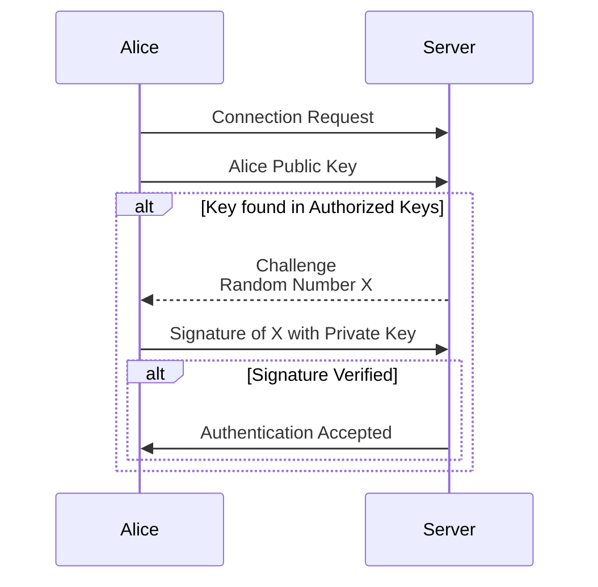
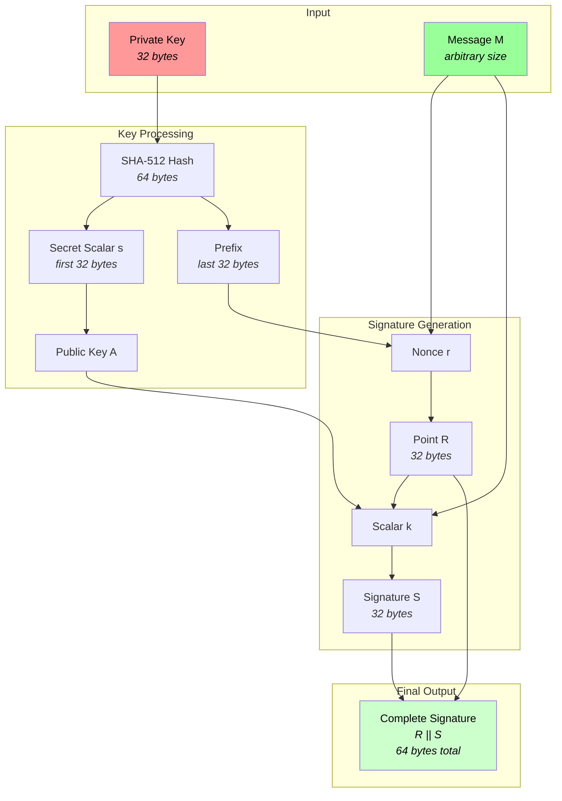

# Toy Ed25519 Signing Tool

> [!CAUTION]
> This project was a learning experience and **should not be used for ANY reason than fun.** 

# What?

## What is this project?

This project is a toy version of edDSA. I wanted to replicate how ssh clients
authenticate using ed25519. When ssh wants a client to authenticate it sends a
challenge to the client and then the client signs the challenge with their
private key.



# Why ? 

## Why ed25519?

I have recently been interested in elliptic curve cryptography and wanted to get
my hands dirty and mess with something that reacts to what I do. I started
messing around with Desmos to better visualize how point addition and
multiplication worked on [regular elliptic
curves](https://www.desmos.com/calculator/s8llodofik), as well as [Montgomery
curves](https://www.desmos.com/calculator/kzjxgt2hly). Unfortunately I was
struggling to do the same with edwards25519. 

## Why Haskell?

Haskell is cool. I have heard many good things about Haskell. To learn Haskell
better, I tricked myself into making a project to get more comfortable with the
language and the paradigm. I may not have done things perfectly, but the
important thing is that it is as correct as it needs to be to work. 

# The Nitty-gritty



One interesting thing that I noticed while diving into supercop. Everything
needs to be constant time. If it isn't done in a way that is O(1) then the
algorithms are susceptible to timing attacks. For this project I mostly ignored
this requirement to focus on the big picture rather than the deep inner workings
of Haskell and it's data structures.

```haskell
-- This is just ==
geequal b c = r
  where
    r :: Word32
    r = (fromIntegral (ub `xor` uc) - 1) `shiftR` 31  -- set matching bits to 0
    -- If b xor c == 0 then b == c. 
    -- 0 - 1 => 1111...1
    -- 1... >> 31 => 1
    -- anything else >> 31 => 0

    -- Cast b and c into 8 bit uints
    ub :: Word8
    ub = fromIntegral b
    uc :: Word8
    uc = fromIntegral c
```

Doing the math to generate points is extremely slow, and you only need to
calculate all the points once. These points are stored in
[Eddata.hs](./Eddata.hs). These points only come into play in the chooseT
function. chooseT takes a point on a coordinate table and then returns a
transformed point. chooseT is used in the base point scalar multiplication
(\[n\]X : X added to itself n times). 


```haskell
chooseT pos b = Ge25519Aff { x = xx, y = y t }
  where
  (Fe25519 xx) = cmov tx (fe25519Neg tx) (negative b)
  tx = Fe25519 $ x t
  t :: Ge25519Aff
  t
    | 1 == geequal b 1 || 1 == geequal b (-1) = Eddata.base_mul_affine !! (5 * pos + 1)
    | 1 == geequal b 2 || 1 == geequal b (-2) = Eddata.base_mul_affine !! (5 * pos + 2)
    | 1 == geequal b 3 || 1 == geequal b (-3) = Eddata.base_mul_affine !! (5 * pos + 3)
    | 1 == geequal b (-4) = Eddata.base_mul_affine !! (5 * pos + 4)
    | otherwise = Eddata.base_mul_affine !! (5 * pos + 0)
```

Here is the main signing function. It takes a message
and a secret key (Private Key || Public Key).

```haskell
-- Message + SecretKey
sign m sk = (\r -> (r ++) <$> sout) =<< bigR
  where
    (fsk, prefix) = BS.splitAt 32 sk
    h =  SHA512.hashByteString fsk

    -- az: 32-byte scalar a, 32-byte randomizer z 
    az =  prunedigest . BS.unpack . SHA512.hashToBinary <$> h
    azt = Prelude.splitAt 32 <$> az
    a = fst <$> azt
    z = snd <$> azt
    bigA = generatePublicKey <$> h

    -- Nonce: r
    r = sc25519from64Bytes . BS.unpack . SHA512.hashToBinary <$>
        (SHA512.hashByteString . BS.pack . (++ m) =<< z)
    bigR = ge25519Pack . ge25519ScalarbaseMult <$> r

    -- h(RAm)
    ram = (\m -> (\a -> (\rr -> rr ++ a ++ m) <$> bigR) =<< bigA) m
    hRAm = SHA512.hashByteString . BS.pack =<< ram
    k = sc25519from64Bytes . BS.unpack . SHA512.hashToBinary <$> hRAm

    -- S = (r + k * s) mod L 
    ks = (\k -> sc25519Mul k <$> (sc25519from32Bytes <$> a)) =<< k
    bigS = (\r -> sc25519Add r <$> ks) =<< r
    sout = sc25519to32Bytes <$> bigS
```

# Resources I used

> These are mainly ed25519 focused and not focused on Haskell

- https://datatracker.ietf.org/doc/html/rfc8032#section-5.1.6
- https://datatracker.ietf.org/doc/html/rfc7748
- https://github.com/floodyberry/supercop/blob/master/crypto_sign/ed25519
- https://github.com/openssh/openssh-portable/blob/master/ed25519.c
